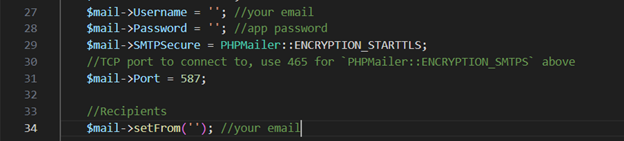

# Ecommerce-application-in-PHP

How to run

Add php gd library for use captcha https://www.youtube.com/watch?v=NJWwKj22n94&t=570s

for email verification create 2 step verification and create app password for your gmail account.

Then in emailVerify.php file, fill 27, 28, 34 lines according to your details. https://www.youtube.com/watch?v=9tD8lA9foxw&t=360s

for mobile verification, create a nexmo (vonage account) to send sms messages in your country.

In mobileVerify.php, add your account credentials in line 14. https://www.youtube.com/watch?v=WAGLhFR34Ng

import the database file

Admin credentials
  Username = admin
  Pw = admin1234

User credentials
  Username = navrath@gmail.com
  Pw = nav
